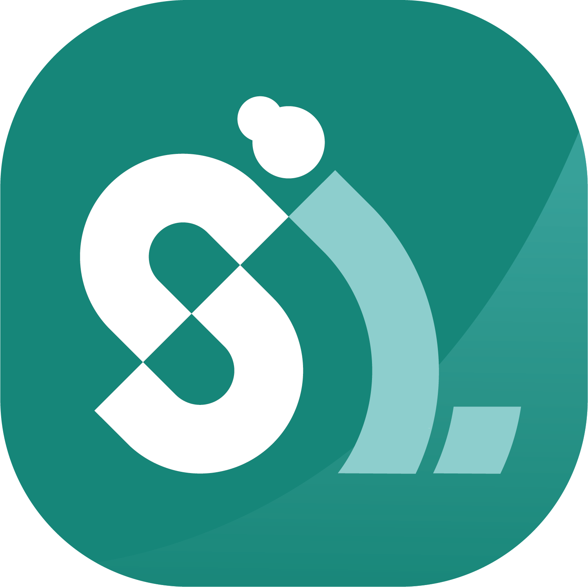

# Mobile-Development
Mobile Development Repository for CS23-PS276 Bangkit Capstone Project "Sahabat Lansia"

# Documentation Link:
* [FIGMA](https://www.figma.com/file/zbVJ5yiJUFHXjzlbGzUXma/Capstone-Project?type=design&node-id=2%3A2&t=WPwY9QCUuHdzGRva-1)
* [USERFLOW](https://drive.google.com/file/d/1JaIzKzxs-a759vNZvRshgCM6SiwZufLg/view)

## Project Setup Guide ⚒

#### Android App

You need to have [Android Studio](https://developer.android.com/studio) Flamingo. After downloading all the requirements, please import the project into
Android Studio, build the project, and click Run. **Please Make sure You have the correct SDK PATH**

## Sample, Screenshots and Demo 📱

